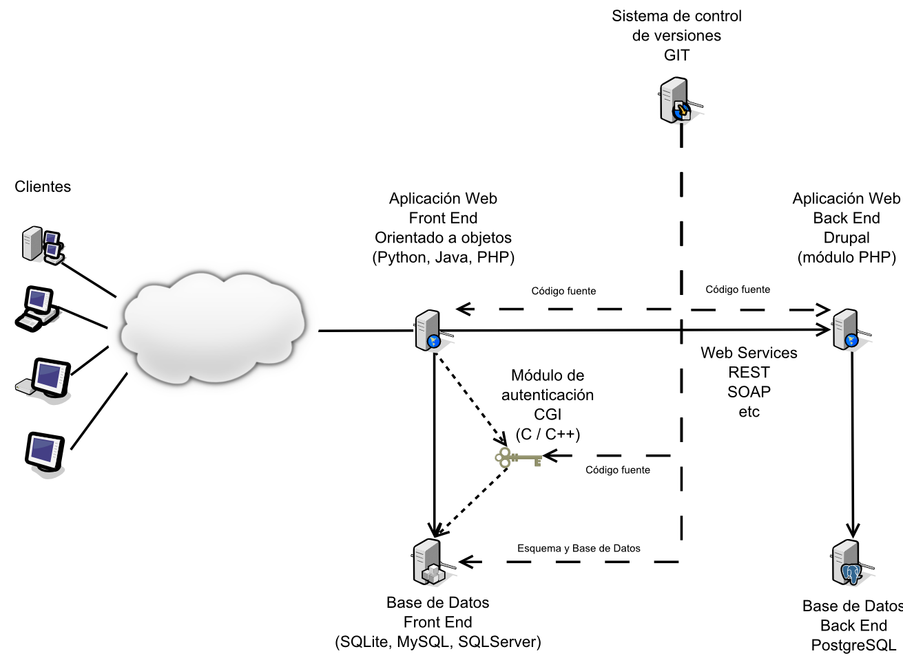

#	DEFINICIÓN DE PROYECTOS PARA BECARIOS

|**ASIGNACIÓN**                                      |                                                   |
|----------------------------------------------------|---------------------------------------------------|
|**ÁREA AL QUE PERTENECE EL PROYECTO:**              |Seguridad en Sistemas                              |
|**NOMBRE DEL RESPONSABLE DE COORDINAR EL PROYECTO:**|Andrés Leonardo Hernández Bermúdez                 |
|                                                    |                                                   |
|**DATOS DEL PROYECTO**                              |                                                   |
|                                                    |                                                   |
|**OBJETIVO DEL PROYECTO:**                          |Implementación de aplicaciones web de forma segura.|
|**DESCRIPCIÓN DEL PROYECTO:**                       |Implementación de una arquitectura de contenido distribuida que comunique mediante web services la capa de presentación Front End con la capa de lógica de negocio y contenido Back End para presentar diversos contenidos web de manera segura.|
|**FECHA DE ASIGNACIÓN DE PROYECTO**                 |[Jueves 13 de marzo de 2014](http://www.timeanddate.com/countdown/generic?iso=20140313T120000&p0=155&msg=[PBSC]+Asignaci%C3%B3n+de+proyecto&csz=1&swk=1)|
|**FECHA DE REVISIÓN INTERMEDIA**                    |[Jueves 20 de marzo de 2014](http://www.timeanddate.com/countdown/generic?iso=20140320T120000&p0=155&msg=[PBSC]+Revisi%C3%B3n+intermedia&csz=1&swk=1)|
|**FECHA DE ENTREGA DE PROYECTO**                    |[Jueves 27 de marzo de 2014](http://www.timeanddate.com/countdown/generic?iso=20140327T120000&p0=155&msg=[PBSC]+Entrega+proyecto+m%C3%B3dulo+2&csz=1&swk=1)|

##	1. ACTIVIDADES A DESARROLLAR:

###	FRONT END

Desarrollo e implementación de una arquitectura de contenidos distribuida que comunique mediante Web Services la capa de presentación Front End con la capa de lógica de negocio y contenido Back End para presentar diversos contenidos web.

El Front End será programado con el paradigma orientado a objetos utilizando el lenguaje de programación PHP, Python o Java, publicando la webapp en un servidor de aplicaciones propio del lenguaje de desarrollo elegido.

La función del Front End es conjuntar el contenido obtenido mediante Web Services desde el Back End y presentarlo en una sola página web que pueda ser personalizada al iniciar sesión. Al visitar el sitio web del Front End de manera anónima se debe presentar una vista genérica que el administrador del sitio pueda modificar.

La base de datos del servidor Front End podrá ser implementada en SQLite, MySQL o SQL Server.

Adicionalmente el Front End debe contar con un módulo de autenticación programado en C o C++ que opere como CGI o FastCGI, el cual permita validar las credenciales de forma cifrada en la base de datos.

###	BACK END

El Back End será un sitio Drupal 7 donde se tendrá que programar un módulo que implemente algún Web Service para transmitir el contenido almacenado en el sitio al servidor Front End, se puede hacer uso de REST, SOAP, JSON o algún otro mecanismo bien conocido para implementar el servicio web.

La base de datos del servidor Back End se implementará en el manejador PostgreSQL.

###	CONSIDERACIONES

Se recomienda el uso de Frameworks para el desarrollo de la aplicación web Front End. Cada equipo debe elegir un framework diferente o trabajar con código hecho a la medida. Las características, requerimientos y mecanismos de trabajo varían de acuerdo a cada uno. 

Se recomienda la instalación del software necesario utilizando los paquetes del sistema operativo y agregar las secciones main, contrib y non-free al archivo /etc/apt/sources.list.
El código fuente tanto de la aplicación web del Front End como del módulo de Drupal del Back End se debe de integrar a un sistema de control de versiones público en GIT, mismo que será sujeto a revisión para validar el avance del proyecto.

El código fuente de los siguientes elementos se debe de integrar a un sistema de control de versiones público en GIT, mismo que será sujeto a revisión para validar el avance del proyecto por integrante:

+ Aplicación Front End.
+ Módulo de autenticación.
+ Esquema de la base de datos.
+ Contenido de la base de datos.
+ Módulo de Drupal 7.

A la entrega del proyecto se debe descargar la última versión del código fuente de cada uno de los elementos listados anteriormente desde el sistema de control de versiones para poner en marcha la aplicación. Únicamente se evaluará el proyecto tomando en cuenta la última versión del código fuente para cada uno de los elementos listados. La configuración de los servicios es independiente del sistema de control de versiones y se evaluará por separado dependiendo de la última configuración aplicada.

Es requerido el cifrado de la conexión entre el servidor Front End y los clientes, es opcional el cifrado de la conexión entre los servidores Front End y Back End.

La documentación del proyecto será entregada vía correo electrónico en archivo fuente de procesador de textos y en formato PDF. Un método alternativo es integrar la documentación en el repositorio de git que se utilizará mediante un wiki o git pages.

###	EXTRAS

Cifrado de la conexión a base de datos en el Front End.

Uso de bases de datos de geolocalización en el Front End para filtrar a los visitantes por país.

El módulo de autenticación se puede reemplazar por una implementación de OAUTH tanto en el módulo en C como en la base de datos del Front End.

###     Vistas

#####   Cuadricula

Debe mostrar 9 entradas de contenido que serán definidas por el administrador, el orden mostrado en cada celda puede ser editado y almacenado en la base de datos. El contenido se obtiene a traves del *WebService* proporcionado por el backend.

Esta es la vista principal de la aplicación en modo anónimo, mostrar un botón o liga para iniciar sesión y una vez iniciada la sesión mostrar un botón o liga para editar el orden de las casillas.

Los usuarios con rol de administrador pueden editar el orden en el que se muestra la página principal, dicho orden debe ser guardado en la base de datos.

+ [Ejemplo](http://www.seguridad.unam.mx/ "Pagina principal de la SSI/UNAM-CERT")
+ [Ejemplo](http://jsfiddle.net/WgF7Z/1/ "HTML5/CSS3")

#####   Login

Formulario de inicio de sesión utilizando usuario y contraseña, el campo **action** debe apuntar al script CGI que funge como módulo de autenticación.

+ [Ejemplo](http://www.cssflow.com/snippets/dark-login-form/demo "HTML5/CSS3")

#####   Listado de contenido ordenado por fecha

Debe listar el contenido ordenado por fecha de la más reciente a la más antigua. El contenido se obtiene a traves del *WebService* proporcionado por el backend.

+ [Ejemplo](http://www.seguridad.unam.mx/noticia/ "www.seguridad.unam.mx")

#####   Vista del contenido

El contenido se obtiene a traves del *WebService* proporcionado por el backend.

Se debe de agregar un campo para enviar comentarios, mismo que a través del webservice elegido publicará el comentario de manera anónima en el backend.

+ [Ejemplo](http://www.seguridad.unam.mx/noticias/?noti=4264 "www.seguridad.unam.mx")
+ [Ejemplo](http://www.seguridad.unam.mx/noticias/?noti=4324 "www.seguridad.unam.mx")
+ [Ejemplo](http://www.seguridad.unam.mx/noticia/?noti=1543 "www.seguridad.unam.mx")

#####   Administración de usuarios

Debe listar a todos los usuarios y visualizar si son usuarios normales o administradores. Además debe de darse la opción para *agregar*, *editar*, o *borrar* usuarios.

Un usuario puede ser o no administrador y debe de poderse cambiar este atributo al editarlo.

Los usuarios se guardan en la base de datos del **Front End** misma que es accedida por el CGI que funge como módulo de autenticación.

+ [Ejemplo](https://www.ldap-account-manager.org/lam/templates/lists/list.php?type=user "user:admin, pw: lam")

#####   CGI y Cookie

Funcionamiento esperado:

+ El usuario visita la página de login y da clic en el enlace o botón que lo manda al inicio de sesión.
+ El usuario introduce sus credenciales en la página de inicio de sesión y las envía al CGI para validación.
+ El CGI recibe por POST y procesa las crendenciales realizando la validación correspondiente con la base de datos.
+ El CGI genera un *token* aleatorio y lo escribe en un archivo.
+ Se regresa una cabecera HTTP "Location: " para redirigir al usuario a una página donde se genera la cookie, la redirección debe contener el *token*.
+ La página que genera la cookie recibe la petición que contiene el *token* y compara el valor con el que almacenó el CGI en el archivo, si los valores coinciden se genera una sesión y se regresará una *cookie* al usuario, en caso contrario se debe manejar un estado de error.
+ Una *alternativa* a los tres pasos anteriores es que **el CGI puede genere la sesión estableciendo la cookie y redireccione al usuario directamente a la página donde pueda interactuar con la aplicación**.
+ La cookie es presentada en todas las peticiones subsecuentes al sitio (esto se realiza de manera automática) y al cerrar la sesión se destruye internamente y es marcada como no válida.

##	2. HERRAMIENTAS Y SOFTWARE QUE DEBE UTILIZAR:

Todas las máquinas virtuales

+ Debian GNU/Linux 7

Sistema de control de versiones

+ Github, Gitorious, etc

Servidor Back End

+ Apache httpd 2.2.x
+ PostgreSQL 8.4 o 9.0

Servidor Front End
WebServices

+ REST, SOAP, JSON, etc

Java

+ Apache Tomcat
+ GlassFish

Frameworks

+ Spring
+ Struts

Python

+ Apache httpd 2.2.x

Frameworks

+ Zope
+ Django
+ Web2Py

PHP

+ Apache httpd 2.2.x

Frameworks

+ Zend
+ CodeIgniter
+ CakePHP

##	3. EVALUACIÓN:

|Elemento                                                                                           |Valor|
|---------------------------------------------------------------------------------------------------|-----|
|**Sistema de control de versiones**                                                                |     |
|Front End - Código fuente de la aplicación principal                                               |  2  |
|Front End - Código fuente del módulo de autenticación                                              |  2  |
|Front End - Esquema de la base de datos*                                                           |  2  |
|Front End - Contenido de la base de datos                                                          |  2  |
|Back End - Código fuente del módulo de Drupal*                                                     |  2  |
|*Total por categoría*                                                                              | 10  |
|**Back End**                                                                                       |     |
|                                                                                                   |     |
|Servidor Apache httpd e Instalación de Drupal 7*                                                   |  5  |
|Configuración de Drupal 7 y elaboración contenido*                                                 |  5  |
|Módulo de Drupal 7*                                                                                | 10  |
|*Total por categoría*                                                                              | 20  |
|                                                                                                   |     |
|**Front End**                                                                                      |     |
|                                                                                                   |     |
|Servidor de aplicaciones*                                                                          |  5  |
|Aplicación web                                                                                     | 20  |
|Módulo de autenticación                                                                            | 10  |
|Módulo de conexión con WebService*                                                                 | 10  |
|Servidor de Bases de datos*                                                                        |  5  |
|Modelado de la base de datos*                                                                      | 10  |
|*Total por categoría*                                                                              | 60  |
|                                                                                                   |     |
|**Documentación**                                                                                  | 10  |
|                                                                                                   |     |
|TOTAL                                                                                              |100  |
|                                                                                                   |     |
|**EXTRA**                                                                                          |     |
|Cifrado de conexión a la base de datos del Front End                                               |  2  |
|Uso de bases de datos de geolocalización para filtrar a los visitantes por país                    |  2  |
|Módulo de autenticación y cambios en la base de datos y aplicación para la compatibilidad con OAUTH|  6  |
|*Total de puntos extra*                                                                            | 20  |

Para la evaluación intermedia se revisaran los siguientes elementos, representa el 30% del puntaje asignado a estos puntos de evaluación:

+ La instalación del servidor de aplicaciones para el Front End.
+ Modelado y el servicio de bases de datos para el Front End.
+ Implementación del Back End incluyendo el módulo de Drupal para WebServices.
+ El código fuente del módulo de Drupal en sistema de control de versiones.

##	4. DIAGRAMA:

##	5. REFERENCIAS:

https://github.com/

https://gitorious.org/

http://packages.debian.org/

http://tomcat.apache.org/

http://httpd.apache.org/

http://modsecurity.org/

https://sqlite.org/

http://www.postgresql.org/

http://www.mysql.com/

http://www.unixodbc.org/

http://www.php.net/

http://www.zend.com/en/

http://flask.pocoo.org/

http://zope2.zope.org/

http://spring.io/

http://struts.apache.org/

http://ellislab.com/codeigniter

https://www.djangoproject.com/

http://www.web2py.com/

http://symfony.com/

http://cakephp.org/

http://www.smarty.net/

https://netbeans.org/

https://www.eclipse.org/

http://www.iis.net/

https://help.github.com/

http://pages.github.com/

https://help.github.com/articles/setting-your-email-in-git

https://help.github.com/articles/markdown-basics

https://help.github.com/articles/github-flavored-markdown

https://wiki.python.org/moin/WebFrameworks

http://dev.maxmind.com/geoip/legacy/mod_geoip2/

http://docs.oracle.com/javase/7/docs/webnotes/install/

http://www.microsoft.com/es-xl/sqlserver/default.aspx

http://open.bekk.no/serving-python-webapps-with-apache

http://www.cs.tut.fi/~jkorpela/forms/cgic.html

http://www.boutell.com/cgic/

https://github.com/tonejo/PBSC8-mod2

